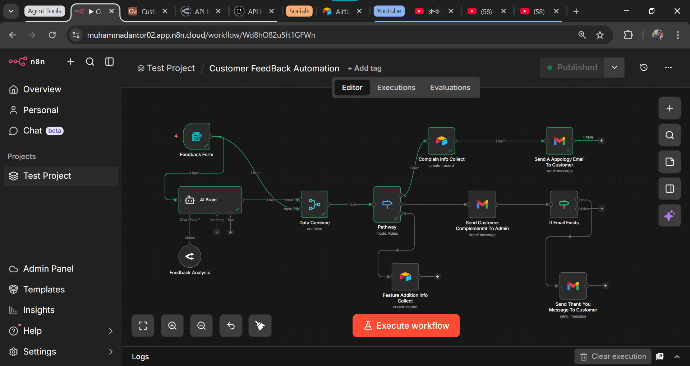

<!--
SEO Keywords: customer feedback automation n8n, AI feedback analysis n8n, complaint detection automation,
n8n customer support workflow, automated feedback response n8n, feedback categorization AI n8n,
n8n email automation workflow, customer experience automation, complaint escalation n8n,
feature request automation n8n, AI feedback agent n8n, AutomateIQ Labs Bangladesh,
n8n workflow automation business, customer feedback AI agent, automated apology email n8n
-->

<div align="center">


<br/>

[](https://n8n.io)
[]()
[]()
[]()
[]()

<br/>

[](https://git.io/typing-svg)

<br/>

> **An automated customer feedback processing system built using n8n — automatically collects feedback, analyzes it using AI, categorizes it, and sends the appropriate response or notification.**

</div>

---

## 📌 Table of Contents

- [🔷 Project Overview](#-project-overview)
- [⚙️ How It Works](#️-how-it-works)
- [🏗 System Architecture](#-system-architecture)
- [🔄 Workflow Logic](#-workflow-logic)
- [🔥 Key Features](#-key-features)
- [🛠 Technologies Used](#-technologies-used)
- [💡 Use Cases](#-use-cases)
- [📂 Project Structure](#-project-structure)
- [🖼 Workflow Screenshot](#-workflow-screenshot)
- [🚀 How To Use](#-how-to-use)
- [📄 License](#-license)
- [👤 Author](#-author)

---

## 🔷 Project Overview

Handling customer feedback manually can be time-consuming.

This automation system solves that problem by automatically analyzing feedback and triggering the appropriate actions.

The workflow performs the following tasks:

1. Collects customer feedback from a form
2. Uses AI to analyze the feedback
3. Identifies whether the feedback is a complaint, feature request, or positive feedback
4. Sends the appropriate response to the customer
5. Notifies the admin if the feedback contains a complaint
6. Stores feature requests for future product improvements

This allows businesses to maintain better customer relationships and respond quickly.

---

## ⚙️ How It Works

```
📝 Customer Submits Feedback
          ↓
🧠 AI Analyzes Feedback Content
          ↓
🔄 Categorize: Complaint / Feature Request / Positive
          ↓
┌─────────────────────────────────────┐
│          Conditional Routing         │
├───────────┬──────────────┬──────────┤
│ Complaint │Feature Request│ Positive │
│     ↓     │      ↓       │    ↓     │
│  Store    │    Save to   │  Send    │
│ Details   │  Database    │ Thank-You│
│     ↓     │              │  Email   │
│  Notify   │              │          │
│   Admin   │              │          │
│     ↓     │              │          │
│  Send     │              │          │
│ Apology   │              │          │
│  Email    │              │          │
└───────────┴──────────────┴──────────┘
```

---

## 🏗 System Architecture

```
┌────────────────────────────────────────────────────────────────┐
│           CUSTOMER FEEDBACK AUTOMATION WORKFLOW                 │
│                                                                  │
│  📝 Feedback Form — Customer Submission                         │
│         │                                                        │
│         ▼                                                        │
│  🧠 AI Agent — Feedback Content Analysis                        │
│    • Understand sentiment & intent                              │
│    • Extract key information                                    │
│    • Determine feedback type                                    │
│         │                                                        │
│         ▼                                                        │
│  🔄 Categorization — Conditional Logic Router                   │
│    ├── 😠 Complaint                                             │
│    │     ├── Store complaint details                            │
│    │     ├── Notify admin immediately                           │
│    │     └── Send apology email to customer                     │
│    │                                                             │
│    ├── 💡 Feature Request                                       │
│    │     └── Save request to database                           │
│    │                                                             │
│    └── 😊 Positive Feedback                                     │
│          └── Send thank-you message to customer                 │
└────────────────────────────────────────────────────────────────┘
```

---

## 🔄 Workflow Logic

The automation follows this process:

1. Customer submits feedback through a form
2. AI analyzes the feedback content
3. Feedback is categorized into different types
4. The workflow routes the feedback using conditional logic

**Possible outcomes:**

**😠 Complaint**
→ Complaint details stored
→ Admin notified
→ Customer receives apology email

**💡 Feature Request**
→ Request saved in database

**😊 Positive Feedback**
→ Customer receives a thank-you message

---

## 🔥 Key Features

| Feature | Description |
|---|---|
| ⚡ **Auto Feedback Processing** | Handles every submission automatically — no manual review needed |
| 🧠 **AI-Powered Analysis** | AI reads and understands feedback intent and sentiment |
| 🚨 **Complaint Detection** | Identifies complaints and escalates to admin immediately |
| 📧 **Automated Apology Email** | Sends personalized apology to unhappy customers automatically |
| 💡 **Feature Request Collection** | Stores product improvement requests in structured database |
| 😊 **Thank-You Message** | Sends appreciation message for positive feedback automatically |
| 🔔 **Admin Notification** | Admin gets instant alert when a complaint is detected |

---

## 🛠 Technologies Used

<div align="center">

| Technology | Purpose |
|:---:|:---:|
|  | Full automation orchestration |
|  | Analyze & categorize feedback |
|  | Send apology & thank-you emails |
|  | Route feedback by category |

</div>

---

## 💡 Use Cases

This system can be used for:

| Use Case | How It Helps |
|---|---|
| 🎧 **Customer Support Automation** | Handle every feedback submission without a support team |
| 📊 **SaaS Product Feedback Management** | Collect and organize user feedback for product teams |
| 👁️ **Customer Experience Monitoring** | Track complaint patterns and improve service quality |
| 📝 **Automated Complaint Handling** | Zero-delay response to unhappy customers |
| 🗂️ **Product Feature Request Tracking** | Build a structured database of improvement ideas |

---

## 📂 Project Structure

```
customer-feedback-automation
│
├── README.md
├── customer_feedback_automation.json
└── workflow_screenshot.png
```

| File | Description |
|---|---|
| `README.md` | Project documentation |
| `customer_feedback_automation.json` | n8n workflow export — import directly into n8n |
| `workflow_screenshot.png` | Full workflow canvas screenshot |

**[📥 Download Workflow JSON](customer_feedback_automation.json)**

---

## 🖼 Workflow Screenshot

<div align="center">

### ⚙️ n8n Workflow — Full Pipeline



> Complete n8n automation pipeline — from feedback submission to auto-response

</div>

---

## 🚀 How To Use

### Prerequisites
- ✅ [n8n](https://n8n.io) instance (self-hosted or cloud)
- ✅ Email account (Gmail / SMTP)
- ✅ AI model API key
- ✅ Database for feature request storage

### Setup Steps

```bash
# 1. Clone this repository
git clone https://github.com/muhammadantor/customer-feedback-automation

# 2. Open n8n
# Go to: n8n → Workflows → Import → select customer_feedback_automation.json

# 3. Configure credentials:
#    - Email account (Gmail OAuth2 or SMTP)
#    - AI model API key
#    - Database credentials

# 4. Activate the workflow ✅
```

The automation will start processing customer feedback automatically.

---

## 📄 License

This project is open-source and available for learning and demonstration purposes.

---

## 👤 Author

<div align="center">


### Muhammad Antor
**AI Automation Engineer | AutomateIQ Labs ⚡**

*Building smart systems that work while you sleep*

[](https://www.linkedin.com/in/muhammad-antor)
[](https://www.facebook.com/automateiq.labs/)
[](mailto:muhammadantor71@gmail.com)
[](https://github.com/muhammadantor)

</div>

---

<div align="center">

**⭐ If this project helped you, please give it a star!**

*Built with ❤️ using n8n · AI Agent · Email Automation*


</div>

<!--
SEO Keywords: customer feedback automation n8n, AI feedback analysis workflow, complaint detection n8n,
n8n customer support automation, automated feedback response system, feedback categorization AI,
n8n email automation, customer experience automation Bangladesh, complaint escalation workflow,
feature request automation n8n, AI feedback agent Bangladesh, AutomateIQ Labs,
n8n workflow automation business, automated apology email system, positive feedback auto-response
-->
